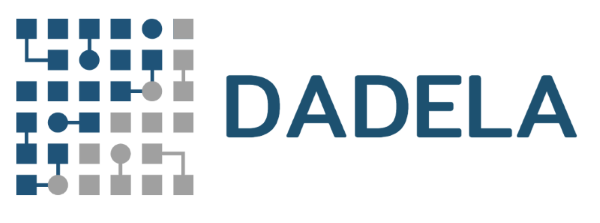

# Dadela

## Introduction

Dadela is a data generation language (DGL);
it creates, inserts and exports records of database tables (entities).

The language was originally designed for
[Forceea data factory framework](https://github.com/nmitrakis/Forceea).

## Scope

The scope of this project is to improve the way we generate business data.

In this context:
* The language specifications are open for discussion among the community members,
* We support every contribution on the further development and application of the language.

## Notations

The definitions use the following notation:
* the symbol `:=` means _is defined as_, e.g. `<Component> := ...` means "Component is defines as ..".
* the symbol `|` means _OR_, e.g. `<Component> := { one | two }` means "Component is defines as one or two".
* the symbols `{` and `}` enclose multiple _alternative_ options, e.g. `{ alpha | beta | delta }`.
* the symbols `[` and `]` enclose _optional_ components, e.g. `[ parameter(<List>) ]`.